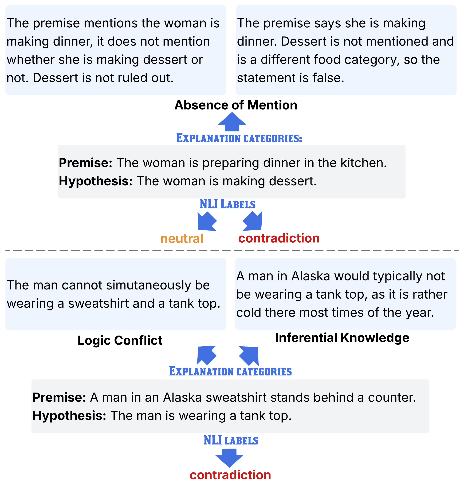

# Agree, Disagree, Explain

This repository contains the public data and reproducible analysis notebook for:

**Agree, Disagree, Explain: Decomposing Human Label Variation in NLI through the Lens of Explanations**



## Overview

Natural language inference annotations often vary across humans. This project studies that variation by looking not only at NLI labels, but also at the explanations annotators provide for their decisions.

The released data includes explanation-level annotations for two NLI sources:

- `annotations_varierr.jsonl`: VariErr examples annotated with NLI labels, free-text explanations, explanation categories, and `annotator_ids`.
- `annotations_livenli.jsonl`: LiveNLI examples annotated with labels, explanations, explanation categories, and `worker_ids`.

The analysis notebook summarizes label variation, explanation-category distributions, category-conditioned label distributions, pair-level variation, and annotator-level patterns.

## Repository Contents

- `annotator_tracking.ipynb`: Reproducible analysis notebook using repository-relative paths.
- `annotations_varierr.jsonl`: Public VariErr annotation file.
- `annotations_livenli.jsonl`: Public LiveNLI annotation file.
- `Agree_Disagree_Explain.pdf`: Paper PDF.

Generated tables and figures are written to `outputs/` when the notebook is run.

## Reproducing the Analysis

Install the Python dependencies:

```bash
pip install -r requirements.txt
```

Then open and run:

```bash
jupyter notebook annotator_tracking.ipynb
```

The notebook assumes it is run from the repository root. It writes CSV summaries and figures such as label distributions, explanation-category distributions, category-conditioned label distributions, pair-level variation summaries, and annotator-level distributions to `outputs/`.

## Citation

If you use this repository, please cite:

```bibtex
@misc{hong2026agreedisagreeexplaindecomposing,
      title={Agree, Disagree, Explain: Decomposing Human Label Variation in NLI through the Lens of Explanations}, 
      author={Pingjun Hong and Beiduo Chen and Siyao Peng and Marie-Catherine de Marneffe and Benjamin Roth and Barbara Plank},
      year={2026},
      eprint={2510.16458},
      archivePrefix={arXiv},
      primaryClass={cs.CL},
      url={https://arxiv.org/abs/2510.16458}, 
}
```
